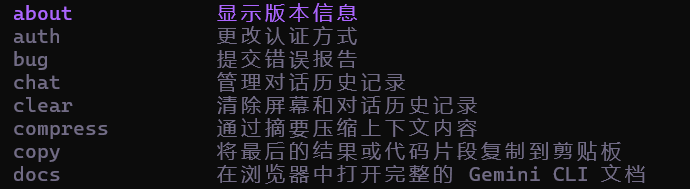
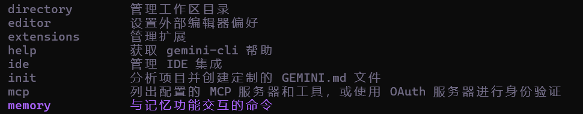
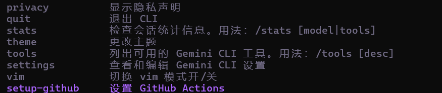
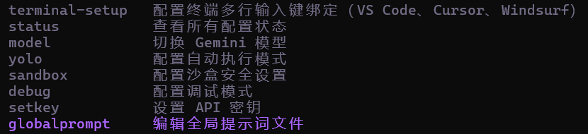
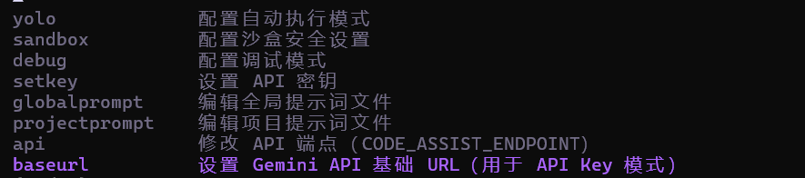

# Gemini CLI 中文汉化版 | Google Gemini CLI Chinese | 谷歌双子座命令行工具中文版

> 🇨🇳 **Gemini CLI 中文汉化增强版** - Google Gemini 官方命令行工具的完整中文汉化版本  
> 🚀 **一键安装** | **完全汉化** | **功能增强** | **开箱即用**  
> 基于 [Google Gemini CLI](https://github.com/google-gemini/gemini-cli) 官方版本进行深度中文汉化和功能增强

**关键词**: Gemini CLI 中文版, Google Gemini 中文, 谷歌双子座CLI, Gemini命令行工具, AI命令行, 人工智能CLI, Gemini汉化版, Google AI中文工具

[](https://github.com/google-gemini/gemini-cli/blob/main/LICENSE)

---

## 🎯 什么是 Gemini CLI？

**Gemini CLI** 是 Google 官方发布的命令行界面工具，让用户可以通过终端直接与 Google 的 Gemini AI 模型进行交互。它支持：

- 🤖 **AI 对话**: 与 Gemini AI 进行智能对话
- 💻 **代码生成**: 自动生成各种编程语言代码
- 📝 **文本处理**: 翻译、总结、改写等文本任务
- 🔧 **开发辅助**: 调试代码、代码审查、技术问答
- 📊 **数据分析**: 处理和分析各种数据格式

## 🌟 为什么需要中文汉化版？

### 🚫 官方版本的问题
- ❌ **全英文界面** - 对中文用户不友好
- ❌ **复杂安装** - 需要手动配置多个步骤
- ❌ **功能单一** - 缺少中国用户常用的功能
- ❌ **API配置困难** - 需要手动修改配置文件

### ✅ 我们的中文汉化版优势
- ✅ **100%中文界面** - 所有提示、菜单、帮助信息全部中文化
- ✅ **一键安装脚本** - 双击 `安装依赖.bat` 即可完成安装
- ✅ **增强功能** - 新增 `/baseurl` 等实用命令
- ✅ **开箱即用** - 预配置所有必要设置
- ✅ **完善文档** - 详细的中文使用指南

## 🎯 适合人群

### 👨‍💻 开发者
- **前端开发**: React、Vue、Angular 代码生成
- **后端开发**: Node.js、Python、Java 接口开发
- **移动开发**: Flutter、React Native 应用开发
- **数据科学**: Python 数据分析、机器学习代码

### 🎓 学生和教育工作者
- **编程学习**: 代码解释、错误调试、算法讲解
- **作业辅助**: 编程作业指导、代码优化建议
- **技术研究**: AI 技术学习、论文写作辅助

### 💼 企业用户
- **文档生成**: API 文档、技术规范自动生成
- **代码审查**: 代码质量检查、安全漏洞扫描
- **技术支持**: 快速解决技术问题、故障排查

### 🔧 个人用户
- **日常编程**: 小工具开发、脚本编写
- **学习提升**: 新技术学习、代码重构
- **创意实现**: 将想法快速转化为代码

---

## 💡 项目理念

### 🌟 零基础也能做软件

我是一名编程爱好者，完全没有系统学过编程，英语水平也很有限。但在 AI 的帮助下，我成功完成了这个项目的所有修改和增强。

**我想证明：** 在 AI 时代，**不懂编程、不懂英语的人，同样可以创造出有价值的软件！**

这个项目就是最好的证明。我希望能激励更多和我一样的朋友：
- 🚀 **勇敢尝试**：不要被技术门槛吓倒
- 🤝 **借助 AI**：让 AI 成为你的编程伙伴  
- 💪 **坚持学习**：在实践中慢慢成长
- 🌈 **分享成果**：把你的创意变成现实

### 🤝 开源不是白嫖

**开源 ≠ 免费获取**  
**开源 = 共同维护**

很多人误解了开源的含义，认为开源就是"拿来就用"。实际上：

- ✅ **开源的本质**：大家一起维护一个好项目
- ✅ **开源的价值**：知识共享，共同进步
- ✅ **开源的责任**：使用者也应该是贡献者

**我需要你的帮助！** 这个项目需要长期维护和改进：
- 🐛 **发现并报告问题**
- 💡 **提出改进建议** 
- 🔧 **贡献代码或文档**
- 📢 **推荐给更多人使用**

**一个人的力量有限，但一群人可以改变世界！**

---

## 🌟 功能特色

### 🇨🇳 完整中文化系统
- **界面汉化**：所有菜单、提示、错误信息完全中文化
- **帮助文档**：详细的中文使用说明和故障排除指南
- **命令说明**：所有内置命令都有中文描述和使用示例
- **友好提示**：从安装到使用，每一步都有清晰的中文指导

### 🔧 增强的 API 管理命令
- **`/baseurl` 命令**：设置 API Key 模式下的基础 URL
  - 完美支持 New API、API2D 等中转服务
  - 即时生效，无需重启程序
  - 配置自动保存，永久生效
  - 支持 `/baseurl clear` 清除设置
- **`/setkey` 命令**：设置 API 密钥，支持中文提示
- **`/api` 命令**：修改内部服务 API 端点（高级用户）

### 📁 便捷的安装启动工具
- **`安装依赖.bat`**：智能安装脚本
  - 自动检测 Node.js 环境（版本 20+）
  - 智能选择 `npm ci` 或 `npm install`
  - 自动处理网络问题和错误重试
  - 提供国内镜像源建议
  - 详细的中文进度提示和错误处理
- **`启动CLI.bat`**：一键启动脚本
  - 双击即可启动，无需命令行操作
  - 自动设置最佳运行环境变量
  - 适合不熟悉命令行的用户

### 🛠️ 用户体验优化
- **错误提示优化**：中文错误信息，提供具体解决方案
- **安装流程简化**：从复杂命令行操作简化为双击运行
- **路径兼容性**：更好地处理中文路径和特殊字符
- **网络优化**：提供国内镜像源配置，解决网络问题

## 📋 完整功能命令列表

### 🎯 基础操作
- **添加上下文**: 使用 `@` 指定文件作为上下文（例如 `@src/myFile.ts`）来针对特定文件或文件夹
- **Shell 模式**: 通过 `!` 执行 shell 命令（例如 `!npm run start`）或使用自然语言（例如"启动服务器"）

### 💬 对话管理命令
- **`/chat`** - 管理对话历史记录
  - `list` - 列出已保存的对话检查点
  - `save <tag>` - 将当前对话保存为检查点
  - `resume <tag>` - 从检查点恢复对话
  - `delete <tag>` - 删除对话检查点
  - `share <file>` - 将当前对话分享为 markdown 或 json 文件
- **`/clear`** - 清除屏幕和对话历史记录
- **`/compress`** - 通过摘要压缩上下文内容
- **`/memory`** - 与记忆功能交互的命令
  - `show` - 显示当前记忆内容
  - `add` - 向记忆中添加内容
  - `refresh` - 从源刷新记忆

### 🔧 系统配置命令
- **`/settings`** - 查看和编辑 Gemini CLI 设置
- **`/auth`** - 更改认证方式
- **`/setkey`** - 设置 API 密钥 🇨🇳
- **`/baseurl`** - 设置 Gemini API 基础 URL（用于 API Key 模式）🇨🇳 **新增**
- **`/api`** - 修改 API 端点（CODE_ASSIST_ENDPOINT）🇨🇳 **新增**
- **`/model`** - 切换 Gemini 模型 🇨🇳
- **`/theme`** - 更改主题
- **`/editor`** - 设置外部编辑器偏好
- **`/privacy`** - 显示隐私声明

### 📁 项目管理命令
- **`/init`** - 分析项目并创建定制的 GEMINI.md 文件
- **`/directory`** - 管理工作区目录
  - `add` - 向工作区添加目录，使用逗号分隔多个路径
  - `show` - 显示工作区中的所有目录
- **`/globalprompt`** - 编辑全局提示词文件 🇨🇳 **新增**
- **`/projectprompt`** - 编辑项目提示词文件 🇨🇳 **新增**

### 🛠️ 开发工具命令
- **`/tools`** - 列出可用的 Gemini CLI 工具，用法：`/tools [desc]`
- **`/copy`** - 将最后的结果或代码片段复制到剪贴板
- **`/vim`** - 切换 vim 模式开/关
- **`/debug`** - 配置调试模式 🇨🇳 **新增**
- **`/yolo`** - 配置自动执行模式 🇨🇳 **新增**
- **`/sandbox`** - 配置沙盒安全设置 🇨🇳 **新增**

### 🔌 集成扩展命令
- **`/ide`** - 管理 IDE 集成
- **`/extensions`** - 管理扩展
  - `list` - 列出活跃的扩展
  - `update <extension-names>|--all` - 更新扩展
- **`/mcp`** - 列出配置的 MCP 服务器和工具，或使用 OAuth 服务器进行身份验证
  - `list` - 列出配置的 MCP 服务器和工具
  - `auth` - 使用支持 OAuth 的 MCP 服务器进行身份验证
  - `refresh` - 重启 MCP 服务器
- **`/setup-github`** - 设置 GitHub Actions
- **`/terminal-setup`** - 配置终端多行输入键绑定（VS Code、Cursor、Windsurf）

### 📊 信息查看命令
- **`/about`** - 显示版本信息
- **`/help`** - 获取 gemini-cli 帮助
- **`/docs`** - 在浏览器中打开完整的 Gemini CLI 文档
- **`/stats`** - 检查会话统计信息，用法：`/stats [model|tools]`
  - `model` - 显示特定模型的使用统计信息
  - `tools` - 显示特定工具的使用统计信息
- **`/status`** - 查看所有配置状态 🇨🇳 **新增**
- **`/bug`** - 提交错误报告
- **`/quit`** - 退出 CLI

### 🎹 键盘快捷键
- **Alt+Left/Right** - 在输入中跳转单词
- **Ctrl+C** - 退出应用程序
- **Ctrl+Enter** - 新行
- **Ctrl+L** - 清除屏幕
- **Ctrl+X** - 在外部编辑器中打开输入
- **Ctrl+Y** - 切换 YOLO 模式
- **Enter** - 发送消息
- **Esc** - 取消操作 / 清除输入（双击）
- **Shift+Tab** - 切换自动接受编辑
- **Up/Down** - 循环浏览您的提示历史记录

> 🇨🇳 标记表示中文汉化版特有功能  
> **新增** 标记表示本版本新增的增强功能

---

## 📸 功能截图

### 🎯 主要功能展示

<div align="center">

#### 🌟 启动界面 - 完整中文化


#### 📋 完整命令列表 - 60+ 中文命令


#### 🔧 增强功能 - /baseurl 命令设置


#### 💡 智能提示 - 中文错误处理


#### ⚙️ 系统配置 - 一键设置管理


</div>

---

## 🚀 快速开始

### 第一步：获取项目
```bash
git clone https://github.com/396001000/gemini-cli-chinese.git
cd gemini-cli-chinese
```

### 第二步：安装依赖（超简单！）
**Windows 用户**：双击运行 `安装依赖.bat`

**其他系统**：
```bash
npm install
npm run build
```

### 第三步：启动程序
**Windows 用户**：双击运行 `启动CLI.bat`

**其他系统**：
```bash
node packages/cli/dist/index.js
```

### 第四步：配置使用
```bash
# 设置 API 密钥
/setkey 你的API密钥

# 设置 API 端点（如果使用中转服务）
/baseurl https://api.aigsv.com/v1

# 开始使用！
你好，请帮我写一个 Python 脚本
```

---

## 📊 版本对比

| 功能特性 | 官方版本 | 超级智体增强版 |
|---------|---------|---------------|
| **界面语言** | 英文 | 🇨🇳 **完整中文** |
| **安装方式** | 复杂命令行 | 🚀 **双击安装** |
| **启动方式** | 命令行启动 | 🎯 **双击启动** |
| **API 端点** | 仅官方端点 | 🔧 **支持中转服务** |
| **错误提示** | 英文技术术语 | 💡 **中文友好提示** |
| **使用门槛** | 需要编程基础 | 📖 **零基础可用** |
| **中文支持** | 基础支持 | ✅ **深度优化** |

---

## 🎯 适合人群

- **编程新手**：想尝试 AI 编程但不知道从哪开始
- **中文用户**：希望有完全中文化的界面和文档
- **企业用户**：需要使用 New API 等中转服务
- **教育用户**：想在教学中使用但担心语言障碍
- **普通用户**：想体验 AI 编程但不想学复杂的命令行

---

## 🤝 参与贡献

### 你可以这样帮助我们：

#### 🐛 发现问题
- 使用过程中遇到任何问题，请 [提交 Issue](../../issues)
- 描述问题时请尽量详细，这样我们能更快解决

#### 💡 提出建议  
- 有任何改进想法，欢迎 [提交 Feature Request](../../issues)
- 不管想法多小，都可能帮助到其他用户

#### 🔧 贡献代码
- 会编程的朋友，欢迎 [提交 Pull Request](../../pulls)
- 不会编程也没关系，可以帮助改进文档

#### 📢 推广项目
- 觉得项目有用，请给个 ⭐ Star
- 推荐给身边有需要的朋友
- 在社交媒体上分享你的使用体验

### 长期维护计划

这个项目需要长期维护，我承诺：
- 🔄 **定期更新**：跟进官方版本的更新
- 🐛 **修复问题**：及时响应和修复用户反馈的问题  
- 📖 **完善文档**：持续改进使用文档和教程
- 🌟 **新增功能**：根据用户需求添加实用功能

**但我需要你们的支持！** 一个人的力量有限，希望有更多朋友能加入进来，一起维护这个项目。

---

## 📄 许可证

本项目基于 Apache License 2.0 许可证开源，详见 [LICENSE](./LICENSE) 文件。

---

<div align="center">

**⭐ 如果这个项目对你有帮助，请给个 Star 支持一下！**

**🤝 期待你的参与，让我们一起把这个项目做得更好！**

---

*基于 [Google Gemini CLI](https://github.com/google-gemini/gemini-cli) 构建*  
*感谢 Google 和开源社区的贡献 ❤️*

</div>